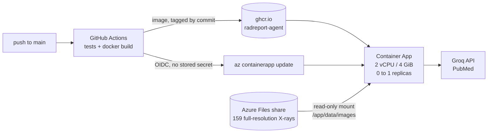

# Deploying live inference to Azure Container Apps

The Streamlit Cloud demo serves precomputed imaging results, because PSPNet peaks
at ~1.8 GB of RAM against a ~1 GB free tier. This deployment runs the real
models on real input: same image as `docker compose`, 4 GiB of memory, and the
full-resolution X-rays mounted from Azure Files.

> **Deployed and verified 2026-09-12.** Every command below was run. The two
> steps that did not work first time are called out where they bit, not
> smoothed over: device code sign-in is blocked outright, and chained
> `containerapp update` calls collide.

**Live:** https://radreport.victoriousriver-f051dbcc.uksouth.azurecontainerapps.io

| Resource | Name |
|---|---|
| Resource group | `radreport-rg` (uksouth) |
| Container Apps environment | `radreport-env` |
| Container app | `radreport`, 2 vCPU / 4 GiB, 0–1 replicas |
| Storage account / file share | `radreportb559c9` / `xrays` |
| Image | `ghcr.io/joynnncode/radreport-agent`, public, linux/amd64 |

---

## What runs where



| Piece | Where it lives | Why |
|---|---|---|
| Code, weights, report corpus, demo cache | Baked into the image | Everything git ships; the image is self-sufficient apart from X-rays |
| X-ray images | Azure Files, mounted read-only | Not in a public image (licence), and not the demo cache's 512 px thumbnails (they change classifier output by up to 0.23) |
| API keys | Container App secrets, exposed as env vars | Never in a layer, never in git |
| Image registry | GHCR, public | Free, and Container Apps pulls it without credentials |

**Two settings that are not defaults, and must stay that way:**

- **`--max-replicas 1`.** A Streamlit session lives in one process, over one
  websocket. A second replica behind the load balancer splits a user's session
  across two processes that know nothing about each other.
- **`--memory 4Gi`.** Measured on this deployment: 48 MB idle, **763 MB peak**
  during live segmentation. That is comfortably under 4 GiB and over 1 GiB, which
  is the free tier this deployment exists to escape. 2 GiB would probably hold,
  but nothing here has tested it.

---

## Before you start: stop it costing money

1. **Budget alert.** Portal → *Cost Management* → *Budgets* → a $5 monthly budget
   with an email alert at 50%. It does not stop spending; it tells you.
2. **Scale to zero** is `--min-replicas 0` below. Replicas are billed only while
   running. Measured here: the replica count reached zero **795 seconds** after
   the last request, and the next request came back healthy in **34 seconds**,
   image pull included. Container Apps has a monthly free grant (180,000
   vCPU-seconds, 360,000 GiB-seconds and 2 million requests, confirmed on the
   pricing page): at 2 vCPU / 4 GiB that is roughly 25 active hours a month
   before charges start.
3. **The off switch** is one command, at the end of this file. Know where it is.

---

## 1. Tools and sign-in

```bash
brew install azure-cli
az extension add --name containerapp --upgrade
```

**Do not use `az login --use-device-code`.** It fails with
`AADSTS530035: BlockedBySecurityDefaults`, and the CLI reports it as the much
more confusing `No subscriptions found for <you>`. Security defaults are on for
every new tenant and they block device code flow outright:

> "Starting July 1, 2026, all new Microsoft Entra tenants block device code flow
> as part of security defaults."

Use the browser flow, which is not blocked:

```bash
az login                     # opens your default browser
az account show --query "{user:user.name, sub:name, id:id}" -o table
```

If the account is a personal Microsoft account, its Azure subscription lives in
a separate *Default Directory* tenant, and sign-in may need that tenant named
explicitly. The tenant's GUID is readable from a public endpoint:

```bash
curl -s https://login.microsoftonline.com/<alias>gmail.onmicrosoft.com/v2.0/.well-known/openid-configuration | jq -r .issuer
az config set core.login_experience_v2=off     # required before --tenant
az login --tenant <that GUID>
```

Then the providers and the resource group:

```bash
RG=radreport-rg
LOC=uksouth
ENV=radreport-env
APP=radreport
IMAGE=ghcr.io/joynnncode/radreport-agent

for ns in Microsoft.App Microsoft.OperationalInsights Microsoft.Storage; do
  az provider register --namespace $ns
done
az group create -n $RG -l $LOC
```

Registration takes a few minutes. Poll with
`az provider show -n Microsoft.App --query registrationState -o tsv` until it
says `Registered`; creating resources before that fails.

---

## 2. Publish the image

Push to `main`. The `docker` job in `.github/workflows/tests.yml` builds on an
amd64 runner and pushes `$IMAGE:<commit sha>` and `$IMAGE:latest`.

Not from the laptop: it is arm64, Container Apps runs amd64, and an image that
has only ever run under emulation is a machine nobody has tried it on.

Check the package is publicly pullable, from a logged-out Docker config:

```bash
DOCKER_CONFIG=$(mktemp -d) docker manifest inspect $IMAGE:latest
```

This repo's package was public on first push. If yours is private, Container
Apps fails to pull with an error that does not say "private": GitHub → your
profile → *Packages* → the package → *Package settings* → *Change visibility*.

---

## 3. Environment and X-ray share

```bash
SA=radreport$(openssl rand -hex 3)   # storage names are global, lowercase, <= 24 chars

az containerapp env create -n $ENV -g $RG -l $LOC
az storage account create -n $SA -g $RG -l $LOC --sku Standard_LRS --kind StorageV2
az storage share-rm create -g $RG --storage-account $SA --name xrays --quota 5

KEY=$(az storage account keys list -g $RG -n $SA --query "[0].value" -o tsv)

az storage file upload-batch --account-name $SA --account-key "$KEY" \
  --destination xrays --source data/images --pattern "*.dcm.png"

az containerapp env storage set -n $ENV -g $RG --storage-name xrays \
  --azure-file-account-name $SA --azure-file-account-key "$KEY" \
  --azure-file-share-name xrays --access-mode ReadOnly
```

`data/images` must exist locally first: `python scripts/fetch_data.py --n-images 200`.
159 files, 308 MB, uploaded in a few minutes.

**Quota 5, not 1.** The data is 308 MB, but `az storage share stats` reports
usage rounded up to whole GiB, so a 1 GiB share reads as 100% full and there is
no headroom for a re-fetch. Standard shares bill on bytes used, not on quota, so
the larger quota costs nothing.

---

## 4. Create the app, then mount the share

Create it without secrets first. The mount has to be added through YAML, and a
YAML round-trip of an app that already has secrets carries their names without
their values.

```bash
az containerapp create -n $APP -g $RG --environment $ENV \
  --image $IMAGE:latest \
  --target-port 8501 --ingress external \
  --cpu 2 --memory 4Gi \
  --min-replicas 0 --max-replicas 1

az containerapp show -n $APP -g $RG -o yaml > /tmp/radreport-app.yaml

.venv/bin/python - <<'EOF'
import yaml
path = "/tmp/radreport-app.yaml"
app = yaml.safe_load(open(path))
template = app["properties"]["template"]
template["volumes"] = [{"name": "xrays", "storageName": "xrays", "storageType": "AzureFile"}]
template["containers"][0]["volumeMounts"] = [{"volumeName": "xrays", "mountPath": "/app/data/images"}]
yaml.safe_dump(app, open(path, "w"), sort_keys=False)
EOF

az containerapp update -n $APP -g $RG --yaml /tmp/radreport-app.yaml
```

The mount path is `/app/data/images` exactly, not `/app/data`: mounting over the
whole directory would hide the report corpus and demo cache baked into the image.

---

## 5. Secrets

**Wait for the previous update to finish before running these.** Chaining them
immediately fails with `Cannot perform operation on container app because
another operation is in progress`, and the failure is easy to miss: the CLI
still exits 0, and the secret appears in `az containerapp show` afterwards, so
only comparing the value proves whether it was written.

```bash
printf 'Groq API key: '; read -rs GROQ_API_KEY; echo

az containerapp secret set -n $APP -g $RG --secrets groq-api-key="$GROQ_API_KEY"
az containerapp update -n $APP -g $RG \
  --set-env-vars GROQ_API_KEY=secretref:groq-api-key NCBI_EMAIL=you@example.com

unset GROQ_API_KEY
```

Verify the value rather than its presence, without printing either side:

```bash
diff <(az containerapp secret show -n $APP -g $RG --secret-name groq-api-key --query value -o tsv | shasum) \
     <(grep -E '^GROQ_API_KEY=' .env | cut -d= -f2- | tr -d '"' | shasum) && echo "secret matches .env"
```

`RADREPORT_DEMO` is deliberately not set. It defaults to `0`, which is the point.

---

## 6. Verify like a stranger

`az containerapp exec` needs a real terminal; from a script or an agent shell it
dies with `termios.error`. Wrap it: `script -q /dev/null az containerapp exec ...`.

```bash
script -q /dev/null az containerapp exec -n $APP -g $RG --command "ls /app/data /app/data/images"
```

Verified on this deployment: `/app/data` holds `demo_cache.json`, `images` and
`reports.csv`, and `/app/data/images` holds 159 `.dcm.png` files. Both halves
matter. The baked files must survive the mount, and the mount must be populated.

```bash
FQDN=$(az containerapp show -n $APP -g $RG --query properties.configuration.ingress.fqdn -o tsv)
curl -fsS https://$FQDN/_stcore/health
az containerapp logs show -n $APP -g $RG --tail 40
```

In the browser, or with the Playwright check that produced these results:

- [x] Safety banner is the first thing visible
- [x] **No** precomputed-demo banner
- [x] The overlay toggle runs PSPNet live and renders lungs and heart
- [x] No `Precomputed result` note anywhere in the output
- [ ] Ask the agent a question end to end, and read the trace panel

Memory, which is the reason this deployment exists:

```bash
az monitor metrics list --resource $(az containerapp show -n $APP -g $RG --query id -o tsv) \
  --metric WorkingSetBytes --interval PT1M --aggregation Maximum -o table
```

Measured: **48 MB idle, 763 MB peak** during live segmentation, against a 4 GiB
limit and the ~1 GB free tier that forced precomputation in the first place.

---

## 7. Deploy from CI

After this, every green push to `main` rolls the app onto that commit's image.
GitHub signs in to Azure with OIDC: Azure trusts tokens GitHub issues for this
repo's `main` branch, so there is no Azure password or key stored in GitHub.

```bash
SUB=$(az account show --query id -o tsv)
TENANT=$(az account show --query tenantId -o tsv)

CLIENT=$(az ad app create --display-name radreport-github-deploy --query appId -o tsv)
az ad sp create --id $CLIENT

az ad app federated-credential create --id $CLIENT --parameters '{
  "name": "radreport-main",
  "issuer": "https://token.actions.githubusercontent.com",
  "subject": "repo:Joynnncode/RadReport-Agent:ref:refs/heads/main",
  "audiences": ["api://AzureADTokenExchange"]
}'

# Scoped to this resource group only, not the subscription.
az role assignment create --assignee $CLIENT --role Contributor \
  --scope $(az group show -n $RG --query id -o tsv)
```

**That subject is probably not the one GitHub will send.** The first run failed
with `AADSTS700213: No matching federated identity record found`, because the
token carried GitHub's *immutable* subject, which embeds numeric account and
repository ids:

```
repo:Joynnncode@174651056/RadReport-Agent@1344840994:ref:refs/heads/main
```

Names can be changed; those ids cannot, which is why the immutable form is the
safer one to trust. Do not try to construct it. Read it back from the failed
run's log (`gh run view <id> --log-failed`, the line beginning `subject claim`)
and register a second credential with exactly that string:

```bash
az ad app federated-credential create --id $CLIENT --parameters '{
  "name": "radreport-main-immutable",
  "issuer": "https://token.actions.githubusercontent.com",
  "subject": "<the subject claim from the log>",
  "audiences": ["api://AzureADTokenExchange"]
}'

gh variable set AZURE_CLIENT_ID       --body $CLIENT
gh variable set AZURE_TENANT_ID       --body $TENANT
gh variable set AZURE_SUBSCRIPTION_ID --body $SUB
gh variable set AZURE_RESOURCE_GROUP  --body $RG
gh variable set AZURE_CONTAINERAPP    --body $APP
```

Expect the order to be circular, because it is: the variables have to exist
before the `deploy` job runs at all, and the subject can only be read off a run
that has already failed. Set the variables, push, let the first deploy fail on
`AADSTS700213`, add the credential, then `gh run rerun <id> --failed`.

The `deploy` job is skipped until `AZURE_CLIENT_ID` exists, so CI stays green
before this step. It pins the app to the commit SHA rather than `:latest`:
re-pointing an app at a tag whose name has not changed does not create a new
revision, and "which commit is live" should be answerable from the portal.

---

## 8. The off switch

```bash
az group delete -n $RG --yes --no-wait                          # app, environment, logs, share
az ad app delete --id $(az ad app list --display-name radreport-github-deploy --query "[0].appId" -o tsv)
gh variable delete AZURE_CLIENT_ID                              # so the deploy job skips again
```

The GHCR image is free and can stay.
