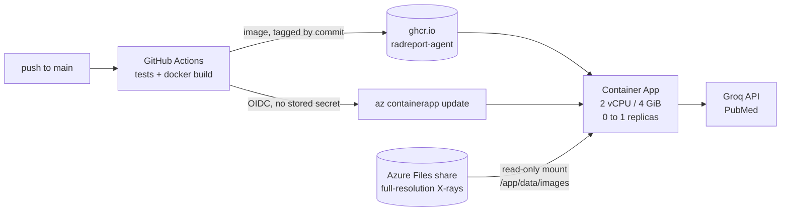

# Deploying live inference to Azure Container Apps

The Streamlit Cloud demo serves precomputed imaging results, because PSPNet peaks
at ~1.8 GB of RAM against a ~1 GB free tier. This deployment runs the real
models on real input: same image as `docker compose`, 4 GB of memory, and the
full-resolution X-rays mounted from Azure Files.

> **Status: written before the first deploy.** The commands follow the Azure CLI
> documentation but have not yet been run against this app. Fix this file as you
> go, and delete this note once every step has actually worked.

---

## What runs where



| Piece | Where it lives | Why |
|---|---|---|
| Code, weights, report corpus, demo cache | Baked into the image | Everything git ships; the image is self-sufficient apart from X-rays |
| X-ray images | Azure Files, mounted read-only | Not in a public image (licence), and not the demo cache's 512 px thumbnails (they change classifier output by up to 0.23) |
| API keys | Container App secrets, exposed as env vars | Never in a layer, never in git |
| Image registry | GHCR, public | Free, and Container Apps can pull it without credentials |

**Two settings that are not defaults, and must stay that way:**

- **`--max-replicas 1`.** A Streamlit session lives in one process, over one
  websocket. A second replica behind the load balancer splits a user's session
  across two processes that know nothing about each other.
- **`--memory 4Gi`.** PSPNet alone peaks at 1.8 GB, DenseNet and Streamlit sit on
  top of that. 2 GiB would reproduce the free-tier OOM with extra steps.

---

## Before you start: stop it costing money

Do this first, not after the first bill.

1. **Budget alert.** Portal → *Cost Management* → *Budgets* → a $5 monthly budget
   with an email alert at 50%. It does not stop spending; it tells you.
2. **Scale to zero** is `--min-replicas 0` below. Replicas stop ~5 minutes after
   the last request and are billed only while running. Container Apps has a
   monthly free grant (180,000 vCPU-seconds and 360,000 GiB-seconds at the time
   of writing, check the pricing page): at 2 vCPU / 4 GiB that is roughly 25
   active hours a month before charges start.
3. **The off switch** is one command, at the end of this file. Know where it is.

The price of scale to zero is a cold start: the first visitor after a quiet
period waits for a ~1 GB (compressed) image pull and a Python boot. Measure it once and put
the number in the README, the same way the Streamlit sleep screen is documented.

---

## 1. Tools and sign-in (once)

```bash
brew install azure-cli
az login
az account show --query "{name:name, id:id}" -o table   # confirm the subscription

az extension add --name containerapp --upgrade
az provider register --namespace Microsoft.App --wait
az provider register --namespace Microsoft.OperationalInsights --wait
az provider register --namespace Microsoft.Storage --wait
```

Every later step uses these. Pick a region near you; `eastus` is only an example.

```bash
RG=radreport-rg
LOC=eastus
ENV=radreport-env
APP=radreport
SA=radreport$(openssl rand -hex 3)   # storage names are global, lowercase, <= 24 chars
IMAGE=ghcr.io/joynnncode/radreport-agent
```

---

## 2. Publish the image

Push to `main`. The `docker` job in `.github/workflows/tests.yml` builds on an
amd64 runner and pushes `$IMAGE:<commit sha>` and `$IMAGE:latest`.

Not from the laptop: it is arm64, Container Apps runs amd64, and an image that
has only ever run under emulation is a machine nobody has tried it on.

**Then make the package public**, once: GitHub → your profile → *Packages* →
`radreport-agent` → *Package settings* → *Change visibility* → Public. A new GHCR
package is private, and Container Apps will fail to pull it with an error that
does not say "private".

```bash
docker pull --platform linux/amd64 $IMAGE:latest   # from a logged-out shell, proves it is public
```

---

## 3. Environment and X-ray share

```bash
az group create -n $RG -l $LOC
az containerapp env create -n $ENV -g $RG -l $LOC

az storage account create -n $SA -g $RG -l $LOC --sku Standard_LRS --kind StorageV2
az storage share-rm create -g $RG --storage-account $SA --name xrays --quota 1

KEY=$(az storage account keys list -g $RG -n $SA --query "[0].value" -o tsv)

az storage file upload-batch --account-name $SA --account-key "$KEY" \
  --destination xrays --source data/images --pattern "*.dcm.png"

az containerapp env storage set -n $ENV -g $RG --storage-name xrays \
  --azure-file-account-name $SA --azure-file-account-key "$KEY" \
  --azure-file-share-name xrays --access-mode ReadOnly
```

`data/images` must exist locally first: `python scripts/fetch_data.py --n-images 200`.

---

## 4. Create the app, then mount the share

Create it without secrets first. The mount has to be added through YAML, and a
YAML round-trip of an app that already has secrets carries their names without
their values; doing it in this order avoids finding out what that does.

```bash
az containerapp create -n $APP -g $RG --environment $ENV \
  --image $IMAGE:latest \
  --target-port 8501 --ingress external \
  --cpu 2 --memory 4Gi \
  --min-replicas 0 --max-replicas 1

az containerapp show -n $APP -g $RG -o yaml > /tmp/radreport-app.yaml

.venv/bin/python - <<'EOF'
import yaml
path = "/tmp/radreport-app.yaml"
app = yaml.safe_load(open(path))
template = app["properties"]["template"]
template["volumes"] = [{"name": "xrays", "storageName": "xrays", "storageType": "AzureFile"}]
template["containers"][0]["volumeMounts"] = [{"volumeName": "xrays", "mountPath": "/app/data/images"}]
yaml.safe_dump(app, open(path, "w"), sort_keys=False)
EOF

az containerapp update -n $APP -g $RG --yaml /tmp/radreport-app.yaml
```

The mount path is `/app/data/images` exactly, not `/app/data`: mounting over the
whole directory would hide the report corpus and demo cache baked into the image.

---

## 5. Secrets

Read the key without echoing it, so it lands in neither the terminal nor shell
history.

```bash
printf 'Groq API key: '; read -rs GROQ_API_KEY; echo

az containerapp secret set -n $APP -g $RG --secrets groq-api-key="$GROQ_API_KEY"
az containerapp update -n $APP -g $RG \
  --set-env-vars GROQ_API_KEY=secretref:groq-api-key NCBI_EMAIL=you@example.com

unset GROQ_API_KEY
```

`RADREPORT_DEMO` is deliberately not set. It defaults to `0`, which is the point.

---

## 6. Verify like a stranger

```bash
FQDN=$(az containerapp show -n $APP -g $RG --query properties.configuration.ingress.fqdn -o tsv)
time curl -fsS https://$FQDN/_stcore/health     # the first call is the cold start
az containerapp logs show -n $APP -g $RG --follow
```

Open `https://$FQDN` in a private window:

- [ ] Safety banner is the first thing visible
- [ ] **No** precomputed-demo banner (if you see it, `RADREPORT_DEMO` is set somewhere)
- [ ] The case list is the full image set, not the 40 demo cases (if it is empty, the share is not mounted)
- [ ] The overlay toggle runs segmentation live, without the replica restarting
- [ ] A tool result in the trace panel has no `precomputed` field
- [ ] "Missing case" and "Out of scope" behave as on the Streamlit demo
- [ ] No key appears anywhere in the page source

Then check memory against the reason this deployment exists:

```bash
az monitor metrics list --resource $(az containerapp show -n $APP -g $RG --query id -o tsv) \
  --metric WorkingSetBytes --interval PT1M --aggregation Maximum -o table
```

If the peak is near 4 GiB, or `RestartCount` climbs after the overlay toggle,
that is the OOM reaper, and the memory setting is wrong rather than the code.

---

## 7. Deploy from CI

After this, every green push to `main` rolls the app onto that commit's image.
GitHub signs in to Azure with OIDC: Azure trusts tokens GitHub issues for this
repo's `main` branch, so there is no Azure password or key stored in GitHub.

```bash
SUB=$(az account show --query id -o tsv)
TENANT=$(az account show --query tenantId -o tsv)

CLIENT=$(az ad app create --display-name radreport-github-deploy --query appId -o tsv)
az ad sp create --id $CLIENT

az ad app federated-credential create --id $CLIENT --parameters '{
  "name": "radreport-main",
  "issuer": "https://token.actions.githubusercontent.com",
  "subject": "repo:Joynnncode/RadReport-Agent:ref:refs/heads/main",
  "audiences": ["api://AzureADTokenExchange"]
}'

# Scoped to this resource group only, not the subscription.
az role assignment create --assignee $CLIENT --role Contributor \
  --scope $(az group show -n $RG --query id -o tsv)

gh variable set AZURE_CLIENT_ID       --body $CLIENT
gh variable set AZURE_TENANT_ID       --body $TENANT
gh variable set AZURE_SUBSCRIPTION_ID --body $SUB
gh variable set AZURE_RESOURCE_GROUP  --body $RG
gh variable set AZURE_CONTAINERAPP    --body $APP
```

The `deploy` job is skipped until `AZURE_CLIENT_ID` exists, so CI stays green
before this step. It pins the app to the commit SHA rather than `:latest`:
re-pointing an app at a tag whose name has not changed does not create a new
revision, and "which commit is live" should be answerable from the portal.

---

## 8. The off switch

```bash
az group delete -n $RG --yes --no-wait                          # app, environment, logs, share
az ad app delete --id $(az ad app list --display-name radreport-github-deploy --query "[0].appId" -o tsv)
gh variable delete AZURE_CLIENT_ID                              # so the deploy job skips again
```

The GHCR image is free and can stay.

---

## After it works, and not before

- Update the README's live demo section: two links, and what distinguishes them
  (precomputed on Streamlit Cloud, live on Azure), plus the measured cold start.
- Put the measured peak memory and cold start in `DECISIONS.md`.
- Then the CV line, with those numbers.
